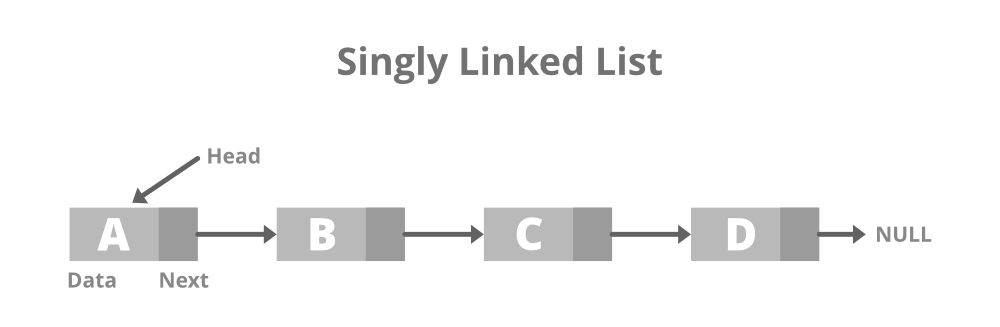

# Linked List

## Definition

A Linked List is a linear data structure which looks like a chain of nodes, where each node contains a data field and a reference(link) to the next node in the list. Unlike Arrays, Linked List elements are not stored at a contiguous location. 

## Common Features of Linked List:

* Node: Each element in a linked list is represented by a node, which contains two components:
  * Data: The actual data or value associated with the element.
  * Next Pointer(or Link): A reference or pointer to the next node in the linked list.
* Head: The first node in a linked list is called the “head.” It serves as the starting point for traversing the list.
* Tail: The last node in a linked list is called the “tail.”

Singly Linked List: In this type of linked list, every node stores the address or reference of the next node in the list and the last node has the next address or reference as NULL. For example: 1->2->3->4->NULL 

### References

[geeksforgeeks - Introduction to Linear Data Structures](https://www.geeksforgeeks.org/introduction-to-linear-data-structures/)